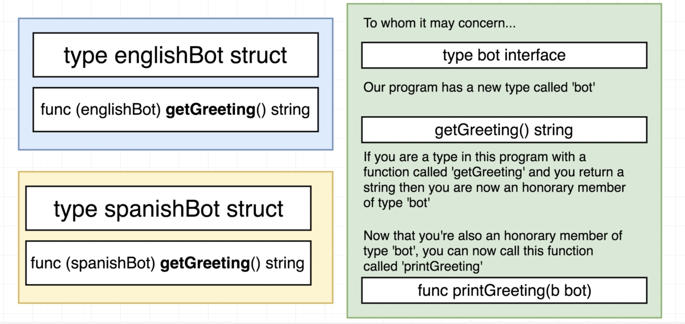

## Interfaces

Interfaces are helping out in making Go code DRY. If there are 2 or more types that would potentially share a function (with the same implementation), we can use an interface that enables all the specified types to use that function. <br>

In the following example we are declaring the bot interface (a brand new type) including 1 or more functions that need to be satisfied in order to include any other type in the interface:

```
    type bot interface {
        getGreeting(string, int) (string, error)
        getBotVersion() float
        respondToUser(user) string
    }
```

Here there is a visual explanation of interface characteristics:

<div style="text-align:center"></div>

Interfaces differ from what we call **concrete types**. These are all those types you can assign a value to (variables) and these are strings, structs, integers, slices etc. but also custom types!

### Extra info

- Interfaces are not generic types;
- They are implicit. You do not have to explicitly/manually define a link between different types that end up into interfaces;
- They are a contract to help us manage types. They are not making sure if you are making logic mistakes inside your code;
- Interfaces are tough. Step #1 is understanding how to read them. It requires time to be able to use them correctly
